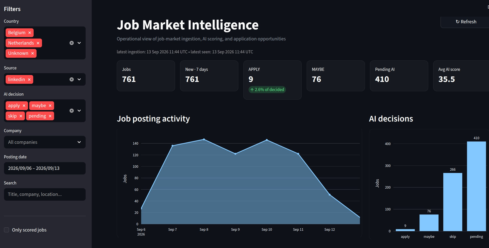
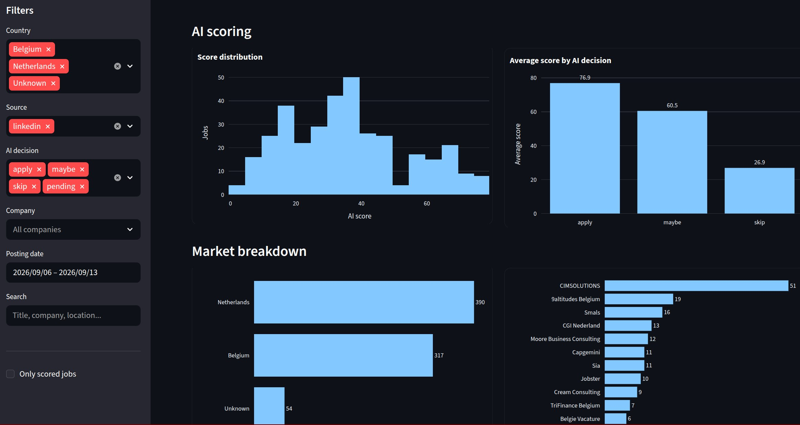

# Job Market Pipeline

An automated data engineering pipeline that collects job postings, processes them with PySpark, stores them in PostgreSQL, evaluates them against a resume using AI, and delivers the best matches based on your criteria through a Telegram bot.


## Dashboard

A simple dashboard was built to explore the collected job-market data.




## Architecture

```text
LinkedIn Jobs
      │
      ▼
Python + BeautifulSoup
      │
      ▼
Raw CSV
      │
      ▼
PySpark
Clean • Normalize • Filter
      │
      ├──> Parquet
      │
      ▼
PostgreSQL
      │
      ▼
AI Job Matching
      │
      ▼
APPLY / MAYBE / SKIP
      │
      ▼
Telegram Bot
```

## Features

- Collects LinkedIn job postings, descriptions, and application links
- Cleans and filters data with PySpark
- Filters senior and high-experience roles before AI scoring
- Stores jobs persistently in PostgreSQL with deduplication
- Scores new jobs against a resume using the OpenAI API
- Classifies jobs as **APPLY**, **MAYBE**, or **SKIP**
- Sends pipeline summaries and failures to Telegram
- Telegram bot for viewing APPLY/MAYBE jobs and database statistics
- Centralized YAML configuration and logging
- Designed for automated server execution

## Tech Stack

**Python · PySpark · PostgreSQL · OpenAI API · BeautifulSoup · Requests · Parquet · Telegram Bot API · YAML · Linux**

## Project Structure

```text
job-market-pipeline/
├── config/
│   ├── config.yaml
│   └── resume.txt
├── data/
│   ├── raw/
│   └── processed/
├── logs/
├── pic/
│   └── dash.jpg
├── src/
│   ├── e.py              # LinkedIn ingestion
│   ├── t.py              # PySpark transformation
│   ├── database.py       # PostgreSQL operations
│   ├── score_jobs.py     # AI job matching
│   ├── telegram_bot.py   # Telegram interface
│   ├── run_pipeline.py   # Pipeline orchestration
│   ├── config.py
│   └── logger.py
├── requirements.txt
└── README.md
```

## Running

Install dependencies:

```bash
pip install -r requirements.txt
```

Set the required environment variables:

```bash
export JOB_DB_PASSWORD="..."
export OPENAI_API_KEY="..."
export TELEGRAM_BOT_TOKEN="..."
export TELEGRAM_CHAT_ID="..."
```

Run the complete pipeline:

```bash
python -m src.run_pipeline
```

Run the Telegram bot:

```bash
python -m src.telegram_bot
```

## Pipeline Flow

Each run:

1. Collects current job postings
2. Cleans and filters them with PySpark
3. Writes processed data to Parquet
4. Upserts jobs into PostgreSQL
5. Scores new jobs with AI
6. Stores the score, decision, and reason
7. Sends a run summary to Telegram


## Purpose

Built as a practical data engineering project covering ingestion, transformation, persistent storage, AI integration, automation, logging, and deployment-oriented pipeline design.

> This project is intended for learning and portfolio purposes. External job sources and APIs may change over time.
