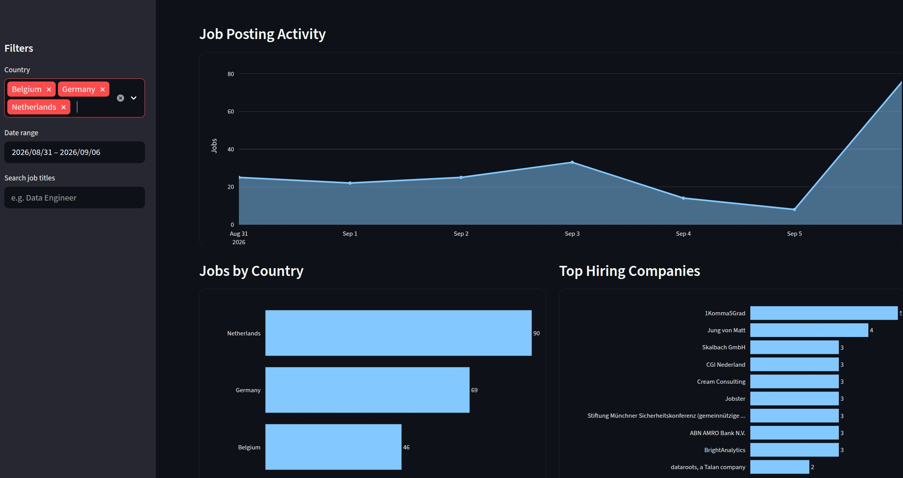

# Job Market Data Pipeline

A small data engineering project I built to practice working with APIs, PySpark, data pipelines, Docker, logging, and dashboards.

The pipeline collects job postings from two sources, cleans and combines them with PySpark, saves the final dataset as Parquet, and displays it in a Streamlit dashboard.

## Pipeline

```text
LinkedIn Jobs ──────> Raw CSV ──┐
                                │
Jobs API ─> Pagination/Retry ─> Raw JSON
                                │
                                v
                             PySpark
                                │
                    Clean + Normalize + Merge
                                │
                                v
                             Parquet
                                │
                                v
                      Streamlit Dashboard
```

## Main Features

* LinkedIn job data collection
* Third-party API ingestion
* Pagination, retries, rate-limit handling
* Raw CSV and JSON storage
* PySpark cleaning and schema normalization
* Duplicate removal
* Parquet output
* YAML configuration
* Pipeline logging
* Single orchestration script
* Docker support
* Streamlit + Plotly dashboard

## Tech Stack

**Python, PySpark, Pandas, Requests, BeautifulSoup, Parquet, YAML, Streamlit, Plotly, Docker**

## Project Structure

```text
job-market-pipeline/
├── config/
│   └── config.yaml
├── data/
│   ├── raw/
│   └── processed/
├── logs/
├── src/
│   ├── e.py
│   ├── ingest_api.py
│   ├── t.py
│   ├── run_pipeline.py
│   ├── config.py
│   ├── logger.py
│   └── dashboard.py
├── requirements.txt
├── Dockerfile
└── README.md
```

## Running the Pipeline

Install dependencies:

```bash
pip install -r requirements.txt
```

Run the complete pipeline:

```bash
python src/run_pipeline.py
```

The orchestration script runs:

```text
1. LinkedIn ingestion
2. API ingestion
3. PySpark transformation
```

The cleaned data is written to:

```text
data/processed/jobs/
```

## Docker

Build the image:

```bash
docker build -t job-market-pipeline .
```

Run the pipeline:

```bash
docker run --rm job-market-pipeline
```

## Dashboard

Run the Streamlit dashboard with:

```bash
streamlit run src/dashboard.py
```

### Dashboard Preview



## What I Practiced

This was mainly a learning project for getting hands-on experience with:

* API ingestion and pagination
* retries and rate limits
* messy data from multiple sources
* PySpark transformations
* Parquet
* configuration and logging
* simple pipeline orchestration
* Docker
* Streamlit dashboards

## Note

This project is for learning and portfolio purposes, so external data sources may change over time.

